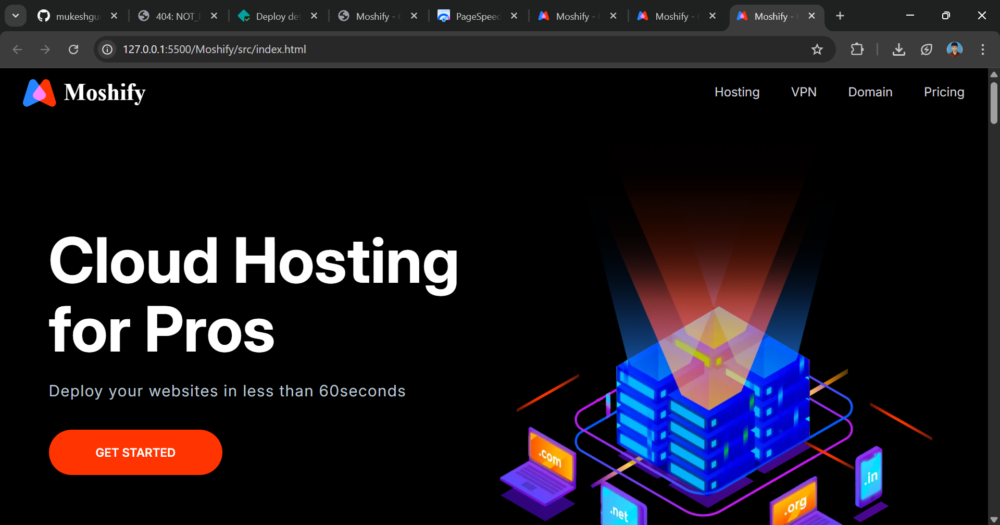
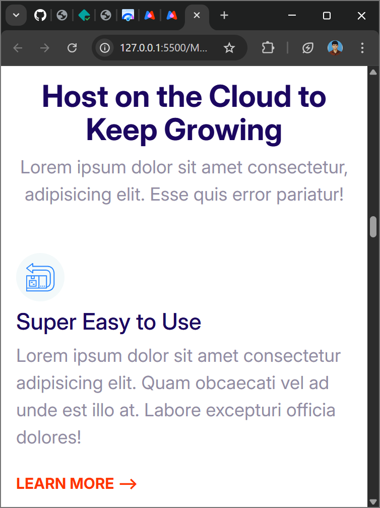
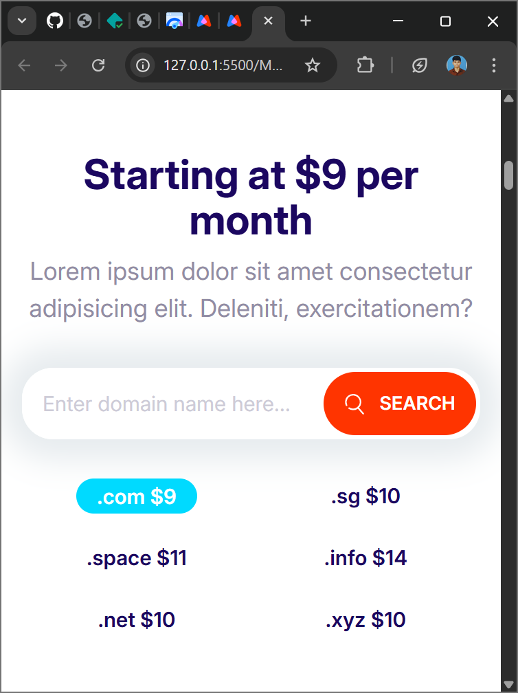

# 🌐 Moshify - Landing Page

A modern and responsive landing page built with **HTML5, CSS3, and JavaScript**, inspired by the "Moshify" project.  
Deployed with **Netlify**.

---

## 🚀 Live Demo  
🔗 [View Website](https://mukeshdev-cloudhost.netlify.app/)

---

## 📸 Screenshots  

### 🖥️ Desktop View  


### 📱 Mobile View  


### 💳 Pricing Section  


### 🌍 Domain Lookup Section  


---

## 🛠️ Tech Stack  
- **HTML5**  
- **CSS3** (Flexbox, Grid, Animations, Responsive Design)  
- **JavaScript (ES6+)**  
- **Responsive Design with Media Queries**  
- **Parcel (Bundler)**


---

## ✨ Features  
- Fully responsive across all devices supports old devices also  
- Optimized for performance (based on Lighthouse report)  
- SEO-friendly structure  
- Modern layout with reusable components  
- Site is very faster and cleaner
- I used BEM Convention for Clean and Maintability 

---

## 📂 Project Structure 
``` 
📁 Moshify/                # Main code of this project is inside src
├─ 📁 src/                 # Source code folder
│  ├─ 🎨 css/             # CSS files
│  ├─ 🖼 images/           # Images used in the project
│  ├─ 💻 js/               # JavaScript files
│  │  └─ main.js           # Main JS file
│  └─ 🌍 index.html           # Entry HTML file
│
├─ 📸 screenshots/         # Screenshots for README
│  ├─ desktop.png          # Desktop screenshot
│  ├─ mobile.png           # Mobile screenshot
│  ├─ price.png            # Price section screenshot
│  └─ domain-lookup.png    # Domain lookup screenshot
│
├─ 📦 package.json         # Project dependencies and metadata
├─ 📑 package-lock.json    # Lockfile for Parcel dependencies
├─ ⚙️ postbuild.js         # Solve parcel sprite hashing error
└─ 📄 README.md            # Project documentation

```


---

## 📊 Lighthouse Report (web.dev)

| Platform | Performance | Accessibility | Best Practices | SEO |
|----------|-------------|---------------|----------------|-----|
| 📱 Mobile  | 91          | 96            | 100            | 91  |
| 🖥️ Desktop | 99          | 96            | 100            | 91  |

---

## 📌 Topics  
`html5` `css3` `javascript` `responsive-design` `moshify` `landing-page`

---

## 📌 Notes
```text
The current code is fully responsive and works across all modern 
and older devices.

For very rare cases if there is any layout issue appeared, there are 
some optional styles kept as commented in the code(in styles.css).

You can uncomment those lines and run the project to solve the issue if required.

```


## 👨‍💻 Author  
Developed by **Mukesh Gurusamy**  
🔗 [GitHub Profile](https://github.com/mukeshgurusamy-dev)

---

✨  I worked so much harder for this project so If you like this project, don’t forget to ⭐ star the repo!


